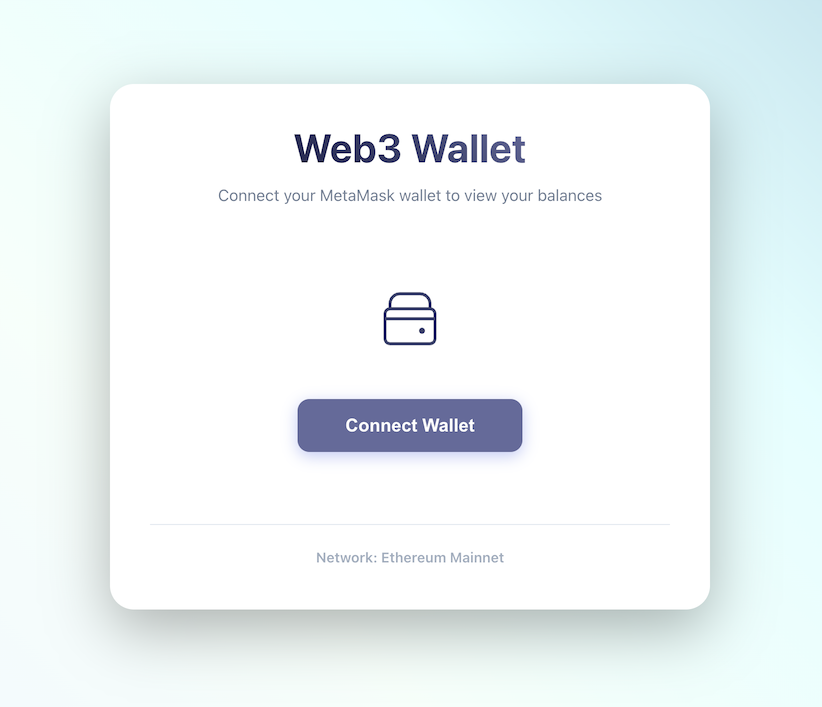
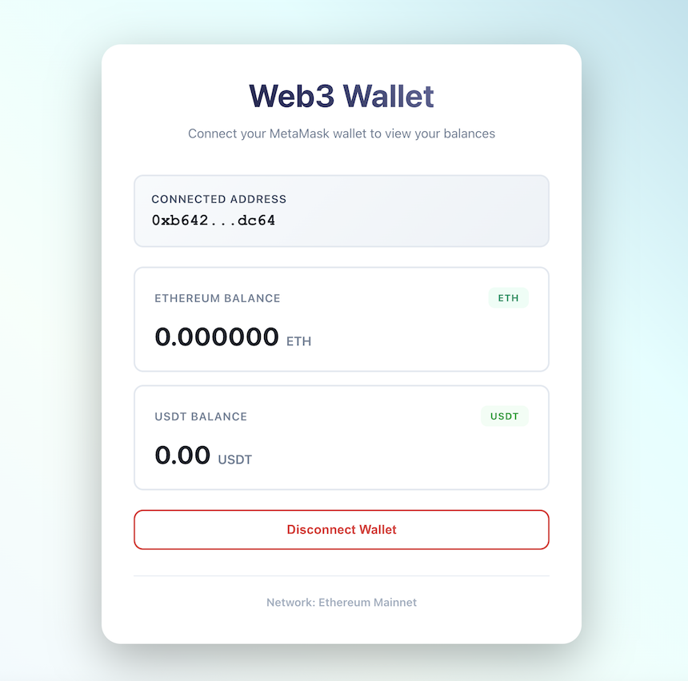

# Web3 Wallet with MetaMask Integration





A simple, responsive Web3 application that allows users to connect their MetaMask wallet and view their ETH and USDT balances. This project was built as a test assignment.

- This app only reads blockchain balances
- No private keys or sensitive data are stored
- No transactions are initiated

## Features

- **MetaMask Integration**: Seamless connection to MetaMask wallet
- **Balance Display**: View your ETH and USDT balances on Ethereum Mainnet
- **Responsive Design**: Works perfectly on desktop, tablet, and mobile devices
- **Real-time Updates**: Automatically updates when you switch accounts or networks
- **Error Handling**: Graceful handling of connection errors and network mismatches
- **Clean UI/UX**: Modern, intuitive interface with smooth animations

## Tech Stack

- **Frontend Framework**: React 19 with TypeScript
- **Web3 Library**: ethers.js v6

## Prerequisites

Before running this application, make sure you have:

- Node.js (v18 or higher) installed
- MetaMask browser extension installed
- An Ethereum wallet with some ETH/USDT (for testing)

## Installation & Running

1. Clone the repository:
```bash
git clone <repository-url>
cd web3-metamask-wallet
```

2. Install dependencies and run:
```bash
bun install
npm run dev
```

The application will be available at `http://localhost:5173` (or another port if 5173 is in use).

### Troubleshooting

1. Make sure MetaMask is installed and you're logged in
2. Switch to Ethereum Mainnet in MetaMask
3. Connect your wallet
4. Verify that your ETH and USDT balances display correctly

## Running Locally

Start the development server:

```bash
npm run dev
```

The application will be available at `http://localhost:5173` (or another port if 5173 is in use).

## Building for Production

Build the application:

```bash
bun run build
```

Publish to Githib Pages:

```bash
bun run deploy
```
